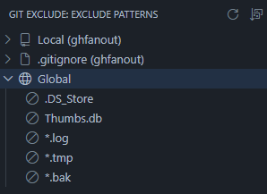
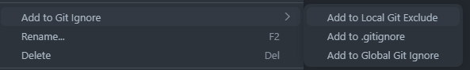

# Git Exclude Explorer

Browse and manage `.git/info/exclude` and your global gitignore in a dedicated tree view, with add/remove from the Explorer context menu.

---

---

## Features

- 🌳 **Tree view** — for each repository, shows its **Local exclude** (`.git/info/exclude`), **`.gitignore`**, and the **Global** gitignore side by side in one sidebar.
- ➕ **Add from Explorer** — right-click any file or folder → **Add to Git Ignore** → choose Local Exclude, `.gitignore`, or Global.
- 🗑️ **Remove inline** — click the trash icon on a pattern to remove it from its source file.
- 🔗 **Jump to definition** — click a pattern to open its file at the matching line.
- 🔀 **Sort toggle** — switch between file-definition order and alphabetical order from the view's toolbar.
- 🔄 **Auto-refresh** — the tree updates automatically whenever the underlying exclude/gitignore files change on disk.
- 🌿 **Worktree & submodule aware** — each worktree resolves its own `.gitignore` while sharing the repository's `.git/info/exclude`.

## Installation

Install it from the Visual Studio Code Marketplace.

<https://marketplace.visualstudio.com/items?itemName=seiya-koji.git-exclude-explorer>

## Usage

1. Open the **Git Exclude** icon in the Activity Bar to reveal the **Exclude Patterns** view.
2. Expand a repository's **Local**, **.gitignore**, or **Global** group to see its patterns.
3. Click a pattern to jump to its line in the source file.
4. To add a new pattern, right-click a file or folder in the Explorer → **Add to Git Ignore** → pick the target (Local Exclude / `.gitignore` / Global).
5. To remove a pattern, right-click it in the tree and choose **Remove from Git Exclude** (or use the inline trash icon).
6. Use the toolbar's sort icon to toggle between definition order and alphabetical order.
